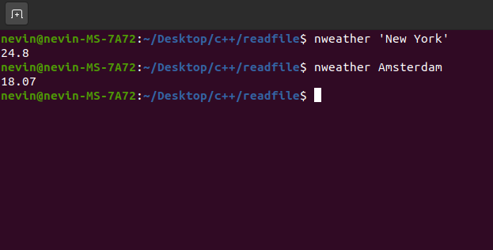

# nweather

A simple command line tool which allows you to get the weather from any country

## Usage
`nweather 'COUNTRY NAME'`
so if you wanted to get the weather for New York
`nweather 'New York'`

## Building
`g++ main.cpp -o nweather`
Then move to /bin/

