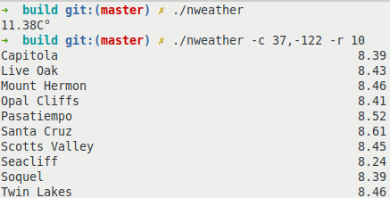

# nweather

A simple command line tool which allows you to get the weather from any country, and more



## Info
nweather is primarily a command line program made for getting the weather and other information about it. It is mainly meant for unix, but it should compile on windows just fine.
I mainly created this as a way for me to learn more about c++, and I plan to add more features

## Usage
```
  ./nweather [OPTION...]

  -i, --imperial         enable imperial units
  -k, --kelvin           enable kelvin units
  -h, --humidity         enable humidity setting
  -c, --coordinates arg  allow coordinates to be used
  -r, --radius arg       get the radius around an area
  -d, --description      get the description of the weather
  -u, --usage            usage information

```

## Building
`./make.sh`
The executable is in `./build`. From there you can move it to `/bin`, or `/usr/local/bin`

## Todo
* Add a flag which will show stats about the weather in one line, which could be used in your statusbar
